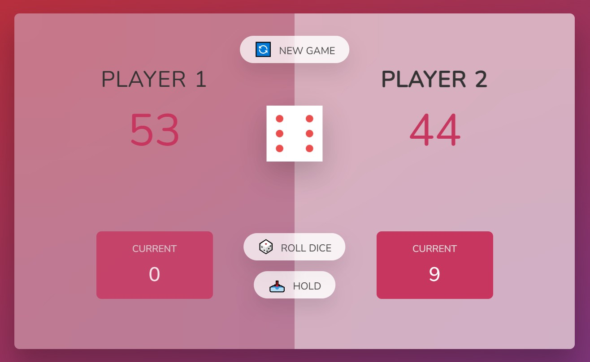

# 📚 Repo for Learning
This is the repository for learning and practicing JavaScript with **The Complete JavaScript Course 2025: From Zero to Expert!**

## 📁 File Structure
```
complete-javascript-course/
├ 01-Fundamentals-Part-1/
├ 02-Fundamentals-Part-2/
├ 03-Developer-Skills/
├ 04-HTML-CSS/
├ 05-Guess-My-Number/
├ 06-Modal/
├ 07-Pig-Game/
│ ├ final/
│ └ starter/
│   ├ script.js
│   ├ README.md
│   └ ...
├ 08-Behind-the-Scenes/
├ ...
├ original-README.md
└ README.md
```

## 🚀 Quick Access to README
- [07-Pig-Game](./07-Pig-Game/starter)



## 📝 Original README
The file below is the original README.md.

[View Original README](./original-README.md)